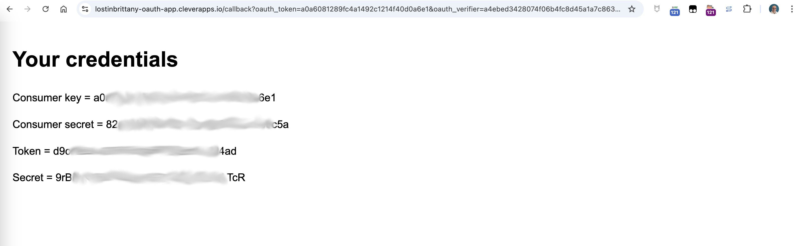

# oauth-consumer-server

This project will help you retrieve tokens to use the Clever Cloud API.

## How to retrieve your API Tokens?

If you wish to use Clever Cloud's API, you will need to create an oauth consumer in the console and to deploy an Application.

### Deploy

#### With the Cli

Make sure you have installed [Clever Tools](https://www.clever-cloud.com/doc/clever-tools/getting_started/).

 - Create our application: `clever create --type maven yourOauthApp`
 - Add a domain name: `clever domain add yourdomain.cleverapps.io`
 - Configure the URL of this application: `clever env set APP_URL https://yourdomain.cleverapps.io/`
 - Deploy the app `clever deploy`

### Create your Consumer

To create a consumer, go in the console and click on Create an Oauth consume or just click [here](https://console.clever-cloud.com/users/me/oauth-consumers/new).

You will have to fill in some fields. The most important are the URLs that link the application previously deployed. 

Now you should have your tokens and be ready to use our API.
